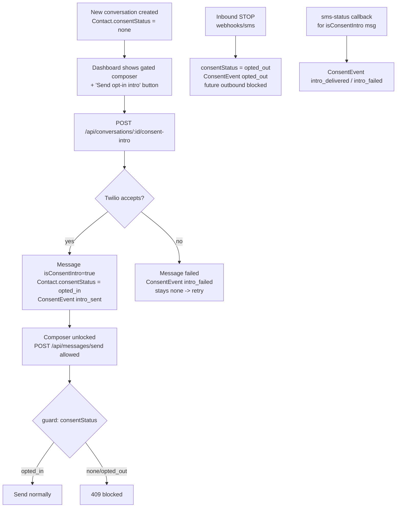

# SMS Opt-In Consent — Design Spec

**Date:** 2026-05-30  
**Status:** Approved (brainstorming)  
**Approach:** Opt-out (TCPA) consent model gated at the outbound send choke point, with a full `ConsentEvent` audit log

## Summary

Every new contact must receive a fixed opt-in intro SMS as the **first outbound message**, and no other outbound text may be sent to that contact until the intro has been sent successfully. The system records permanent evidence of the intro (and subsequent consent events) in a dedicated `ConsentEvent` audit table. Enforcement lives on the server at the single outbound send choke point (`app/api/messages/send/route.ts`), so it cannot be bypassed by the UI or the send-first path. The dashboard surfaces a gated composer: for a contact with no consent yet, the normal composer is replaced by a required **"Send opt-in intro"** button.

## Intro message (fixed text)

> Hi, this is EyeWatch LIVE. You're receiving service-related SMS alerts for resident care and support. Reply STOP to opt out. Msg & data rates may apply.

Stored as a single exported constant in `lib/consent.ts` and reused by both the server send path and the UI preview so the wording can never drift.

## Goals

- Require the intro SMS as the first outbound message to any contact.
- Block all other outbound messages to a contact until the intro is sent successfully.
- Store permanent, queryable evidence that the intro was sent (and delivered/failed), tied to the contact, the message, and the user who sent it.
- Honor STOP replies by blocking further outbound messages and recording the opt-out.
- Enforce on the server, not just the UI.

## Non-Goals (v1)

- Inbound-first contacts — confirmed out of scope; all conversations are outbound-initiated.
- Re-subscribe / START keyword handling after an opt-out (manual/admin handling for now).
- Double opt-in (confirmation reply) — this is an opt-out model.
- Per-facility or templated variants of the intro text.
- A dedicated consent/audit reporting UI (the `ConsentEvent` data is queryable; no screen in v1).

## Background

### Current behavior (from codebase exploration)

- Single outbound SMS choke point: `app/api/messages/send/route.ts` calls `twilioClient.messages.create`. No consent check today.
- `Contact` (`prisma/schema.prisma`) has **no** consent/opt-in fields.
- `Conversation.status` is operational workflow only; `Message.status` is Twilio delivery lifecycle only.
- Contacts/conversations can be created via: `POST /api/conversations`, the send-first path in `POST /api/messages/send`, `POST /api/contacts`, and the inbound webhook `POST /api/webhooks/sms`.
- Inbound webhook and `sms-status` webhook exist; no STOP handling beyond Twilio defaults.

### Stakeholder decisions

| Decision | Choice |
|---|---|
| Inbound-first contacts | Out of scope — never occurs |
| Evidence level | Full audit log — separate `ConsentEvent` table |
| UI enforcement | Gated composer + required "Send opt-in intro" button |
| Unlock timing | Accept-on-send (Twilio accepts → `opted_in`), not delivery-gated |
| Re-subscribe (START) | Out of scope (manual) |

## Consent model

Opt-out model. A contact has one of three consent states:

- `none` — no intro sent yet (default for every new contact). Outbound blocked **except** the intro itself.
- `opted_in` — intro sent successfully (Twilio accepted: status `queued`/`sent`). Normal messaging allowed.
- `opted_out` — replied STOP. All outbound blocked.

Unlock timing is **accept-on-send**: the contact flips to `opted_in` as soon as Twilio accepts the intro, matching the "sends successfully" UX. Delivery confirmation is recorded as evidence but does not gate sending.

## Data model changes (Prisma)

### `Contact` (denormalized state for fast gate checks)

- `consentStatus` — enum `ConsentStatus { none | opted_in | opted_out }`, default `none`.
- `consentUpdatedAt` — `DateTime?`.

### `Message`

- `isConsentIntro` — `Boolean @default(false)`. Flags the intro message so the `sms-status` webhook can attribute delivery evidence.

### New `ConsentEvent` (full audit log)

| Field | Type | Notes |
|---|---|---|
| `id` | String (uuid) | PK |
| `contactId` | String → `Contact` | indexed |
| `messageId` | String? → `Message` | the intro message, when applicable |
| `userId` | String? → `User` | staff member who triggered (null for system/inbound) |
| `type` | enum `ConsentEventType { intro_sent \| intro_delivered \| intro_failed \| opted_out }` | |
| `twilioSid` | String? | |
| `detail` | String? | free-text (e.g. error message, STOP keyword matched) |
| `createdAt` | DateTime @default(now()) | indexed |

Relations: `Contact.consentEvents`, `Message.consentEvents` (nullable back-relation). `onDelete`: cascade from `Contact`; `SetNull` from `Message`/`User` to preserve the audit trail.

## Server-side enforcement

### New endpoint: `POST /api/conversations/[id]/consent-intro`

1. `requireSession()`.
2. Load conversation + contact.
3. If `contact.consentStatus === opted_in` → no-op success (idempotent, already enrolled).
4. If `contact.consentStatus === opted_out` → 409 with "contact opted out".
5. Send the exact `OPT_IN_INTRO_TEXT` via Twilio (`statusCallback` to `sms-status` as today).
6. Create `Message` (`direction: outbound`, `isConsentIntro: true`, `twilioSid`, status `sent`/`queued`).
7. On Twilio success (transaction): set `Contact.consentStatus = opted_in`, `consentUpdatedAt = now()`; insert `ConsentEvent { type: intro_sent, messageId, userId, twilioSid }`; update conversation `lastMessageAt` (and existing status behavior).
8. On Twilio failure: persist the failed `Message` (status `failed`, `errorMessage`); insert `ConsentEvent { type: intro_failed, detail }`; leave `consentStatus = none`; return error so UI can show retry.

### `POST /api/messages/send` (guard added)

After resolving the contact, before `twilioClient.messages.create`:

- `consentStatus === none` → 409 "Send the opt-in intro first." (closes the send-first bypass)
- `consentStatus === opted_out` → 409 "Contact has opted out."
- `consentStatus === opted_in` → proceed as today.

This route never sends the intro itself; the intro only goes through the dedicated endpoint.

### `POST /api/webhooks/sms` (inbound STOP handling)

- Normalize the inbound body; if it matches a STOP-family keyword (`STOP`, `STOPALL`, `UNSUBSCRIBE`, `CANCEL`, `END`, `QUIT`), set `contact.consentStatus = opted_out`, `consentUpdatedAt = now()`, and insert `ConsentEvent { type: opted_out, detail: <keyword> }`.
- Continue existing inbound message persistence regardless.

### `POST /api/webhooks/sms-status` (delivery evidence)

- When a status callback resolves a `Message` with `isConsentIntro === true`:
  - terminal `delivered` → insert `ConsentEvent { type: intro_delivered, messageId, twilioSid }`.
  - terminal `failed`/`undelivered` → insert `ConsentEvent { type: intro_failed, messageId, twilioSid, detail }`.
- Existing `Message.status` mapping is unchanged. (Delivery does not change `consentStatus` under accept-on-send.)

## UI

In `DashboardClient` / `MessageComposer`, branch on the active conversation contact's `consentStatus`:

- `none`: replace the normal composer with a prominent **"Send opt-in intro"** button plus a read-only preview of `OPT_IN_INTRO_TEXT`. Clicking calls `POST /api/conversations/[id]/consent-intro`; on success the thread refreshes and the composer unlocks. On failure, show the error and allow retry.
- `opted_out`: composer disabled with an "This contact has opted out of SMS" notice.
- `opted_in`: normal composer (current behavior).

The gate keys off the **contact**, so a returning `opted_in` contact starting a new conversation skips the intro automatically. The intro `Message` appears in the thread like any outbound message (optionally badged as the opt-in message via `isConsentIntro`).

## Data flow

## Error handling

- Twilio rejection of the intro: surfaced to the UI; contact stays `none`; `intro_failed` recorded; retry allowed.
- Concurrent intro sends: idempotency check (`opted_in` → no-op) plus DB transaction guards against duplicate enrollment; duplicate intros are acceptable but should be avoided by the idempotency check.
- Send guard 409s carry a machine-readable code (`consent_required`, `consent_opted_out`) so the client can render the right state.

## Testing (Vitest)

- `POST /api/messages/send` returns 409 `consent_required` when `consentStatus === none`; 409 `consent_opted_out` when `opted_out`; proceeds when `opted_in`.
- consent-intro endpoint: success path sets `opted_in` + writes `intro_sent` + `isConsentIntro` message; failure path leaves `none` + writes `intro_failed`; `opted_out` contact returns 409; `opted_in` contact is a no-op.
- inbound webhook STOP keyword detection sets `opted_out` + writes `opted_out` event.
- `sms-status` webhook writes `intro_delivered` / `intro_failed` for intro messages only.
- Intro text constant matches the approved wording exactly.

## Migration notes

- New enums `ConsentStatus`, `ConsentEventType`; new `ConsentEvent` table; new `Contact.consentStatus` (default `none`), `Contact.consentUpdatedAt`; new `Message.isConsentIntro` (default `false`).
- Existing contacts default to `consentStatus = none`, meaning they will be gated until an intro is sent. This is the safe/compliant default; flag for stakeholder confirmation if any existing contacts should be backfilled to `opted_in`.
